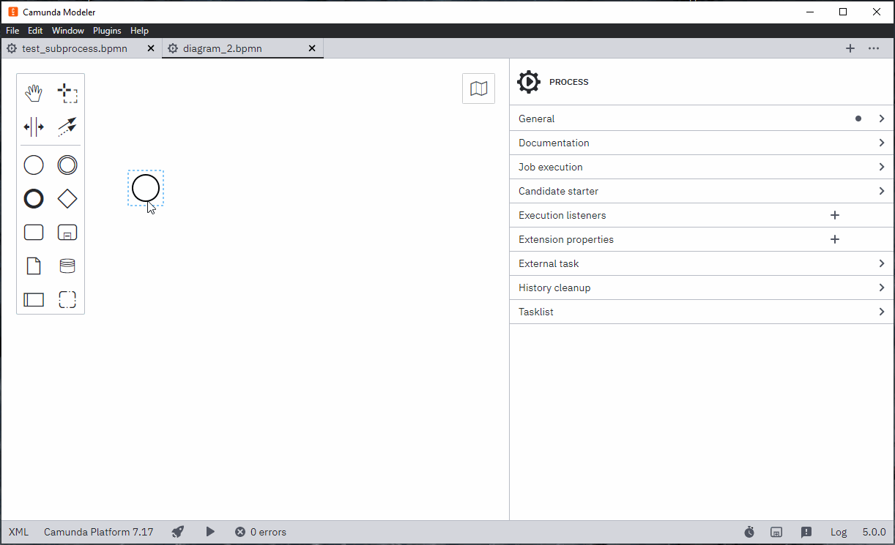

# Camunda Modeler Multi-Diagram plug-in

[](https://github.com/camunda/camunda-modeler)

A [Camunda Modeler](https://github.com/camunda/camunda-modeler) plug-in based on the [plug-in example](https://github.com/camunda/camunda-modeler-plugin-example).

## How to install the plugin

Download the latest [release zip](https://github.com/sharedchains/camunda-modeler-plugin-multidiagram/releases/) and extract it to your camunda-modeler/resources/plugins folder. That's all!

## About

This plug-in adds the ability to Camunda modeler to manage multiple diagrams on a single bpmn file, as intended on BPMN specifications. Then it's possible to link, on a multi-diagram bpmn, as Caller element for a Call Activity task, one of the processes inside the bpmn file itself.



## Development Setup

Use [npm](https://www.npmjs.com/), the [Node.js](https://nodejs.org/en/) package manager to download and install required dependencies:

```sh
npm install
```

To make the Camunda Modeler aware of your plug-in you must link the plug-in to the [Camunda Modeler plug-in directory](https://github.com/camunda/camunda-modeler/tree/develop/docs/plugins#plugging-into-the-camunda-modeler) via a symbolic link.
Available utilities to do that are [`mklink /d`](https://docs.microsoft.com/en-us/windows-server/administration/windows-commands/mklink) on Windows and [`ln -s`](https://linux.die.net/man/1/ln) on MacOS / Linux.

Re-start the app in order to recognize the newly linked plug-in.


## Building the Plug-in

You may spawn the development setup to watch source files and re-build the client plug-in on changes:

```sh
npm run dev
```

Given you've setup and linked your plug-in [as explained above](#development-setup), you should be able to reload the modeler to pick up plug-in changes. To do so, open the app's built in development toos via `F12`. Then, within the development tools press the reload shortcuts `CTRL + R` or `CMD + R` to reload the app.


To prepare the plug-in for release, executing all necessary steps, run:

```sh
npm run all
```

## Compatibility Notice

This plugin is currently compatible with the following Camunda Modeler versions.

| Camunda Modeler | MultiDiagram Plugin |
|-----------------|---------------------|
| 3.4 - 4.12      | 1.0.1               |
| 5.x             | 2.0 or newer        |

## Additional Resources

* [bpmn-js](https://github.com/sharedchains/bpmn-js/tree/feature/multipleDiagram)
* [Camunda modeler](https://github.com/sharedchains/camunda-modeler/tree/feature/multiDiagrams)
* [Plug-ins documentation](https://docs.camunda.io/docs/components/modeler/desktop-modeler/plugins/)

## Licence

MIT
